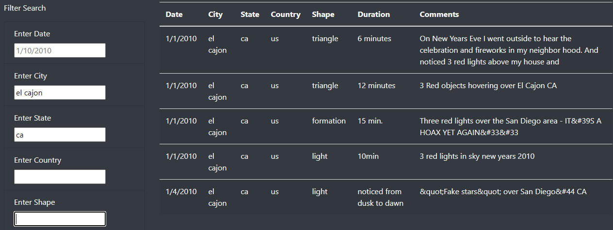

# UFOs

## Overview of the Analysis
Dana is interested in developing a webpage and dynamic table that will give an in-depth analysis of UFO sightings.  She wants to build a site that will allow users to input information and based on the input the site will filter so that the users will only see what they want to see.

## Results of the Analysis
Users are able to go into the site and input in the filters based on: date, city, state, country and shape.  The user may as many search criteria as they would like.  Once they have entered the search criteria and press enter, the results will populate.

Here's an example: a user would like to see all of the UFO Sightings in El Cajon, California.  Below is an image of what that search would return.

As you can see in the image. The user entered: El Cajon in the "Enter City" and ca in the "Enter State" and their desired results were returned to them.

## Summary
Overall the webpage is pretty neat and good site to go to to find information for UFO Sightings.

One drawback to this site is that it is a static site, meaning the data is what it is.  Currently, for the data to be updated, someone would need to complete that update manually.

## Recommendations for Further Development
1. Add search criteria for duration and comments.  Currently, users are unable to search based on these 2 criteria and some users may find this beneficial.
2. Add an element where new information/sightings can be entered and the site will be updated based on the newly entered information.
